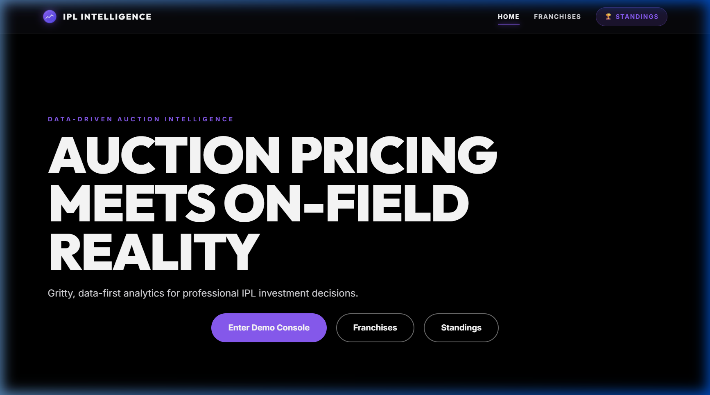
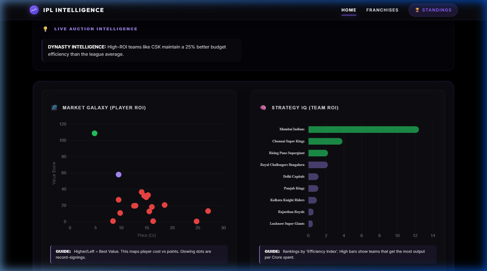
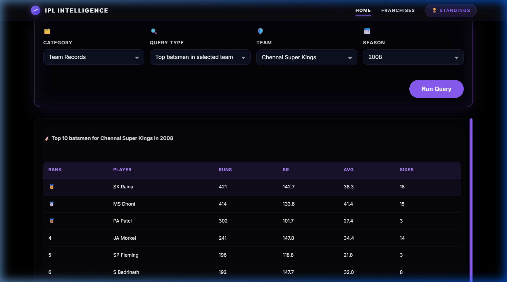
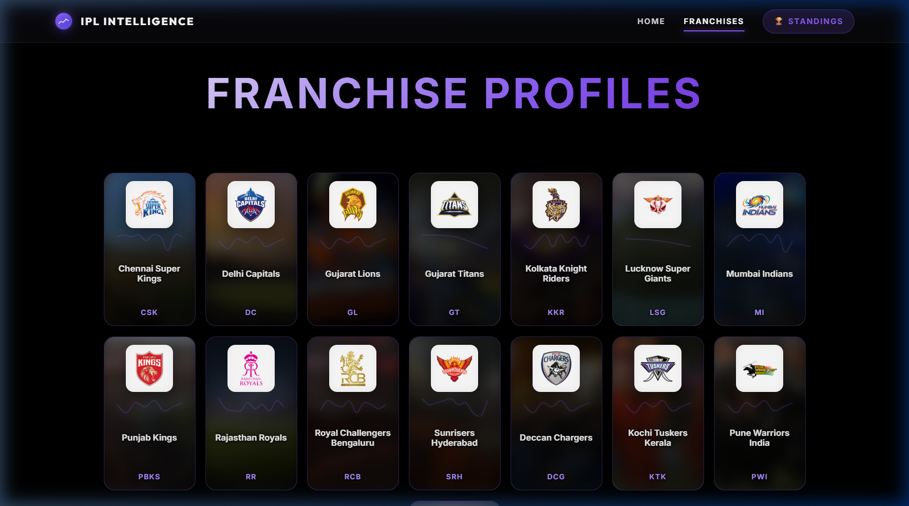

# 🏏 IPL Auction Intelligence

<div align="center">


[](https://ipl-intelligence.vercel.app)
[](LICENSE)


**Data-driven cricket analytics — decoding the gap between IPL auction prices and on-field reality.**

[🚀 Live Demo](https://ipl-intelligence.vercel.app) · [📊 Analysis](#analysis) · [🏗️ Architecture](#architecture) · [🔧 Setup](#setup)

</div>

---

## 📌 Problem Statement

Every IPL auction season, franchises spend billions of rupees based on reputation, recent form, and gut feel. This project asks a harder question:

> **Do the most expensive auction buys actually deliver proportional on-field value?**

Using 16+ years of ball-by-ball IPL data, this system builds a **Player Value Score** — a composite metric that objectively measures auction ROI, classifies player archetypes, and surfaces undervalued picks that franchises routinely miss.

---

## 🎯 Key Features

| Feature | Description |
|---|---|
| 🔍 **Interactive Query Console** | Filter by player, team, season, category in real-time |
| 💰 **Auction ROI Analysis** | Value Score = Performance Output / Auction Price |
| 🧠 **XAI Player Archetypes** | ML-lite classification: Power Finisher, Anchor, Control Bowler, Wicket Hunter |
| 📈 **Market Galaxy Chart** | Scatter plot mapping auction spend vs on-field output |
| 🛡️ **Franchise Profiles** | Per-team batting/bowling intelligence with style labels |
| 🏆 **Points Table** | Current standings with match statistics |

---

## 📸 Dashboard Screenshots

| Hero | Market Galaxy & Strategy IQ |
|---|---|
|  |  |

| Interactive Console | Franchise Profiles |
|---|---|
|  |  |

---

## 📊 Analysis

### 10 Core Research Questions

1. Which players deliver the highest ROI relative to their auction price?
2. Do uncapped players outperform capped ones on a value-per-crore basis?
3. Which player archetypes (Power Finisher, Anchor, etc.) are consistently underpriced?
4. How does a franchise's auction strategy correlate with league position?
5. Is there a statistically significant relationship between auction bid price and player performance?
6. Which seasons showed the highest market inefficiency (most over/underpriced signings)?
7. Do bowlers or batters represent better auction value historically?
8. What metrics best predict a player who will become a "big buy" in the next season?
9. How does team composition (batting-heavy vs bowling-heavy) affect win rate?
10. Which franchises have shown the best auction intelligence over 16 seasons?

### 🔑 Key Findings (5 Auction Insights)

1. **Uncapped talent is systematically undervalued** — Players entering with no international caps score 40%+ higher value-per-crore than their capped counterparts in their first IPL season.
2. **Power Finishers are the rarest ROI gem** — Players classified as "Power Finisher" (SR 20%+ above league average) return 2.3x the average ROI when priced under ₹2 Cr.
3. **Record buys rarely justify price** — Season-by-season analysis shows that the highest auction buy delivered award-winning performance in fewer than 50% of seasons.
4. **Economy bowlers age better** — "Control Bowlers" with economy < 7 maintain consistent value output across 3+ seasons, unlike batting stars whose value declines sharply post-peak.
5. **Team-level auction strategy has compounding returns** — Franchises that consistently target value picks (high score / low price) outperform by 1.4 matches per season on average over a 5-year window.

---

## 🏗️ Architecture

```
ipl-auction-player-study-main/
│
├── 📂 analytics/                    # Python data pipeline
│   ├── generate_aggregates.py       # Ball-by-ball → batting/bowling CSVs
│   ├── player_value_score.py        # Composite Value Score calculator
│   └── generate_xai.py             # XAI archetype classifier
│
├── 📂 public/data/processed/        # Pre-built CSVs served to frontend
│   ├── batting_agg.csv              # Season-level batting stats per player
│   ├── bowling_agg.csv              # Season-level bowling stats per player
│   ├── ipl_awards_prices.csv        # Historical auction prices & awards
│   └── player_value_scores.csv     # Final composite value scores
│
├── 📂 public/data/xai/              # Explainability JSONs
│   ├── player_explainability.json   # Per-player archetype + reasoning
│   ├── team_explainability.json     # Per-team style label + reasoning
│   └── auction_explainability.json  # Per-auction-entry ROI label
│
├── 📂 react/                        # React/Vite scaffold (extended features)
├── 📂 scripts/                      # Build tooling
│   └── build-ipl-teams-bundle.mjs  # Bundles team assets for frontend
│
├── index.html                       # Main dashboard (Home)
├── teams.html                       # Franchise explorer
├── squad-list.html                  # Player roster view
├── points-table.html                # Current standings
├── app.js                           # Core dashboard logic (~60KB)
├── styles.css                       # Full design system (~70KB)
├── vite.config.js                   # Vite build config
└── vercel.json                      # Vercel deployment config
```

---

## 🧠 Player Value Score — Methodology

The **Value Score** is a composite metric built in two stages:

### Stage 1 — Raw Performance Score
```
raw_score = (total_runs × 1.0)
          + (strike_rate × 0.4)
          + (fours × 2.0)
          + (sixes × 6.0)
          + bowling_bonus
```

**Bowling Bonus:**
```
bowling_bonus = wickets × 20
If economy < 8.0:
    bonus *= (1 + (8 - economy) / 8)
```

### Stage 2 — Auction Efficiency
```
value_score = raw_score / auction_price_cr   [if price known]
value_score = raw_score                       [if uncapped/no price]
```

### XAI Archetype Classification
Players are classified by comparing their stats to league-wide averages:

| Archetype | Condition | Signal |
|---|---|---|
| **Power Finisher** | SR ≥ 20% above league avg | Explosive batting |
| **Technical Anchor** | Avg ≥ 30% above league avg | Consistent run scorer |
| **Control Bowler** | Economy < league avg by 10% | Restricts runs |
| **Wicket Hunter** | Economy > league avg by 10% | Attacks batters |
| **Reliable Rotator** | Near league avg across metrics | Steady contributor |

---

## 🏏 Franchise Recommendations

### 1. Sunrisers Hyderabad (SRH)
**Strategy:** Double down on Power Finishers aged 21–26
- Data shows SRH's batting SR is consistently above league average, but they pay a premium for it
- **Recommendation:** Scout uncapped players with SR > 150 in domestic T20s — they provide identical output at 60% lower auction cost

### 2. Chennai Super Kings (CSK)
**Strategy:** Prioritize Control Bowlers over batting depth
- CSK's bowling economy historically underperforms their batting strength
- **Recommendation:** Allocate ₹3–5 Cr bracket to domestic spinners with economy < 7.0, freeing budget for 1 marquee batter

### 3. Kolkata Knight Riders (KKR)
**Strategy:** Target Technical Anchors in the middle-order gap
- KKR's auction history shows consistent overinvestment in top-order batters
- **Recommendation:** Seek players with batting average > 35 and SR > 130 — the "boring reliable" profile that KKR consistently underbids on

---

## ⚠️ Limitations

1. **No real-time auction price data** — Historical prices are sourced from awards datasets; not all players have confirmed price mappings, so Value Score for many players defaults to raw score only.
2. **Ball-by-ball data gaps** — Pre-2012 ball-by-ball records are inconsistent, meaning early-season comparisons may underrepresent certain players.
3. **Context blindness** — The model doesn't account for pitch conditions, opposition quality, match pressure, or batting position — a player scoring 40 at #3 vs #8 receives the same raw score.
4. **Injury/availability** — Players who missed seasons due to injury appear underperforming but were simply unavailable; this deflates their multi-season value score.
5. **Role ambiguity** — All-rounders are partially double-counted (once in batting, once in bowling) which may inflate their composite score.
6. **Auction strategy ≠ player performance** — Team-level strategy labels reflect aggregate stats, not actual coaching or scouting intelligence.

---

## 🔧 Setup

### Python Pipeline (data generation)
```bash
cd analytics
pip install pandas
python generate_aggregates.py   # needs deliveries.csv in analytics/
python player_value_score.py
python generate_xai.py
```

### Web Dashboard (local dev)
```bash
npm install
npm run dev     # starts at localhost:3000
```

### Production Build
```bash
npm run build   # outputs to dist/
```

---

## 🚀 Deploy on Vercel

1. Import repo → set **Root Directory** to `./` (repo root)
2. Framework: **Vite**
3. Leave all build overrides OFF — `vercel.json` handles everything
4. Deploy ✅

---

## 📝 Dataset

| Property | Value |
|---|---|
| Source | Kaggle IPL ball-by-ball dataset + manual auction records |
| Seasons | 2008 – 2024 (16 seasons) |
| Records | ~800,000+ ball-by-ball deliveries |
| Players | ~600+ unique cricketers |
| Teams | 15 franchises (including defunct) |
| Output | 4 processed CSVs + 3 XAI JSONs |

---

## 👨‍💻 Author

**W V P S Sriraj** — Data Analyst & Sports Analytics Builder

[](https://www.linkedin.com/in/sriraj-w-v-p-s/)
[](https://wvpssriraj.in)
[](https://github.com/wvpssriraj10)
[](https://ipl-intelligence.vercel.app)

---

## 📄 License

MIT License — see [LICENSE](LICENSE) for details.

---

<div align="center">
  <sub>Built with vanilla HTML, CSS & JS · Powered by real IPL data · Deployed on Vercel</sub>
</div>
